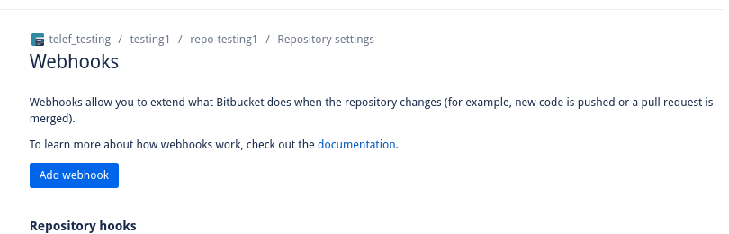
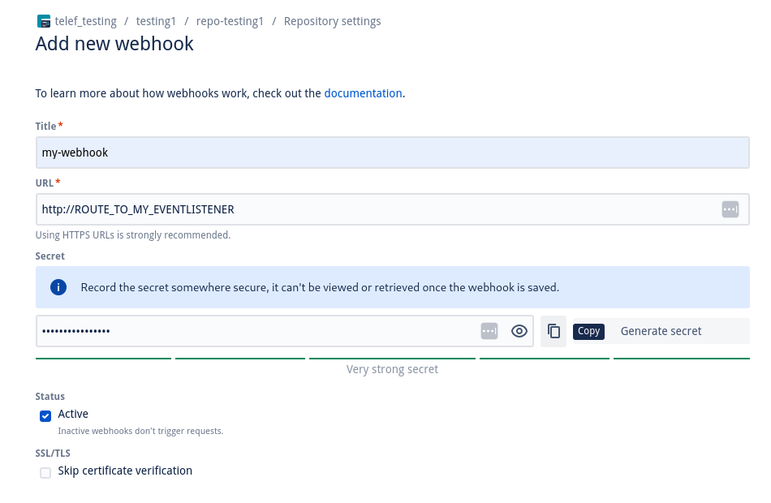
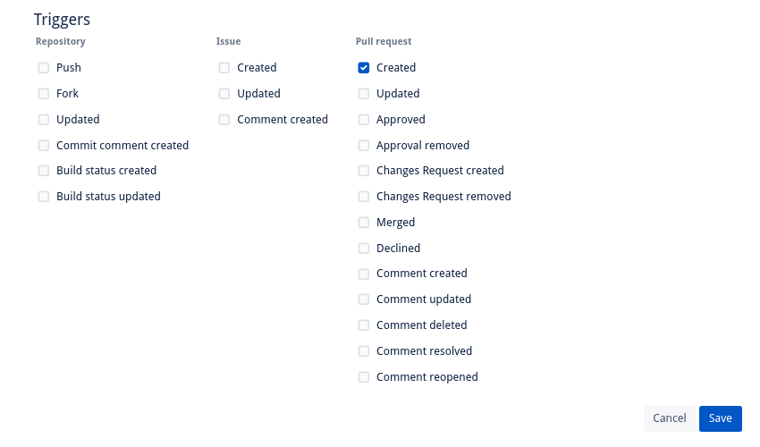
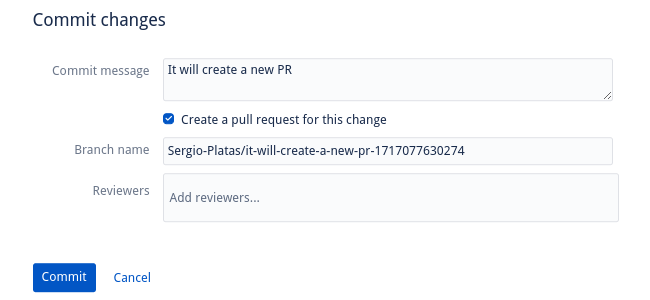
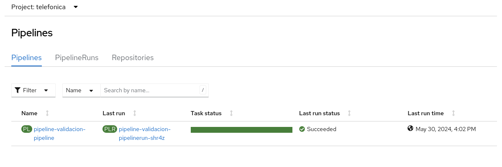

# argocd-example-application

## Installation
- Openshift Pipelines
- Openshift GitOps

```
oc apply -f ./cluster-configuration
```
Wait till both operators are installed

Configure Argo CD instance with an account that can access the API

```
oc apply -f ./argocd-configuration
```

## Argo CD diff with a pipeline

### Get Argo CD configuration
Get Argo CD server address.
```
oc -n openshift-gitops get route openshift-gitops-server -o jsonpath='{.spec.host}'
```

Get Argo CD admin password:
```
oc extract secret/openshift-gitops-cluster -n openshift-gitops --to=-
```

Then generate a new token for the account pipeline-account
```
argocd login <<ArgCD-server> --username admin --password <<ArgCD-password>>
argocd account generate-token --account pipeline-account
```

Set the new token in the value argocd.toke
This value is set in the pullrequest/pipeline/argocd-env-secret.yaml

### Deploy pipelines

```
helm upgrade pipelines ./pullrequest/pipeline/ --install --set argocd.token=<<ArgCD-token>>
```

### Deploy application Set

```
oc apply -f argocd/appset-discount-kustomize.yaml
oc apply -f argocd/appset-discount-helm.yaml
```

Synchronize all the Argo CD applications

### Create a new branch with changes

Create a new branch called diff.
Make changes in the applications configurations, folders "discounts-helm" and "discouts-kustomize".

### Start pipeline

Execute the pull request pipeline with the branch diff. We will see the Argo CD diff

```
tkn pipeline start pull-request-pipeline -n ci --param revision=diff --param source-repo=https://github.com/davidseve/argocd-example-application  --workspace name=diff-result,claimName=workspace-pvc-diff-result --workspace name=source-folder,claimName=workspace-pvc-source-folder
```
## Argo CD diff manual

- Create an application in Argo CD
- Create a new branch called diff
- Change the number of replicas in staging deployment.yaml
- Commit and push changed to diff-branch

```
ARGOCD_ROUTE=$(oc -n openshift-gitops get route openshift-gitops-server -o jsonpath='{.spec.host}')

argocd login --name admin --password <<CHANGE_ME>> $ARGOCD_ROUTE

argocd app diff openshift-gitops/staging-discounts --revision  diff-branch
```

Out put should be like this:

```
===== apps/Deployment openshift-gitops/discounts ======
134c134
<   replicas: 1
---
>   replicas: 8
```


## Bitbucket: webhook integration


### Prerequisites:

- Add a webhook in your Bitbucket repository

Go to Bitbucket admin console to create a webhook.

1. Go to your *Repository* / *Repository settings* and select *'Webhooks'*




2. Click on *'Add webhook'* and complete the following data:

- Title:
- URL: You can change this value later, with the route created in Openshift.
- Triggers:
    - Unselect 'Push' (Repository list)
    - Select 'Created' (Pull request list)

> **_NOTE:_**  YOU HAVE A BUTTON TO COPY THE SECRET YOU WILL NEED TO CREATE LATER IN OPENSHIFT: PLEASE CLICK IT.




Select the option 'Pull request' => 'Created'. This will trigger the execution of the webhook only when a PR is created.



Finally save the changes.


### Objects:

To trigger the execution of a pipeline from the creation of a pull request (PR), it is necessary to create a serie of objects in our Openshift cluster.
These objects are created with command run previuously 'helm upgrade pipelines ...'
You should to update some values:

- Secret:

    The secret generated when Webhooks was created in Bitbucket console (step 2).
    You should to update file 'pullrequest/pipeline/templates/pull-request-pipeline-repo-access-token-secret.yaml' with that information.

    ```
    data:
        token: CHANGE_ME
    ```

- Route: 

    It will be invoked from webhook execution.
    File: pullrequest/pipeline/templates/pull-request-pipeline-eventlistener-route.yaml

    ```
    kind: Route
    metadata:
    annotations:
        openshift.io/host.generated: "true"
    name: el-pull-request-pipeline
    namespace: ci
    spec:
        host: change_me
        # EXAMPLE
        # host: el-pull-request-pipeline-eventlistener-ci.apps.cluster-49lc7.dynamic.redhatworkshops.io
    ```

- EventListenerService: NO CHANGES REQUIRED
    (pullrequest/pipeline/templates/pull-request-pipeline-eventlistener-service.yaml)

- EventListener: NO CHANGES REQUIRED
    (pullrequest/pipeline/templates/pull-request-pipeline-eventlistener.yaml) 

- TriggerBinding: NO CHANGES REQUIRED 
    (pullrequest/pipeline/templates/pull-request-pipeline-triggerbinding.yaml) 

- TriggerTemplate: NO CHANGES REQUIRED
    (pullrequest/pipeline/templates/pull-request-pipeline-triggertemplate.yaml)


Once these objects were modified, run again this command: 

```
helm upgrade pipelines ./pullrequest/pipeline/ --install --set argocd.token=<<ArgCD-token>>
```

From this moment, when a PR is CREATED in your Bitbucket repository, a new PipelineRun wil be created as follows: 

Remember to select the 'Create a pull request for this change' option




Once you Commit the changes, your pipeline will be triggered:


