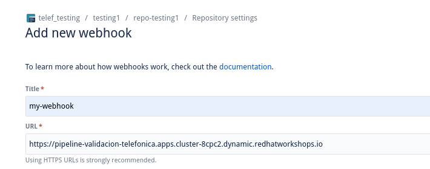

# argocd-example-application

## Installation
- Openshift Pipelines
- Openshift GitOps

```
oc apply -f ./cluster-configuration
```
Wait till both operators are installed

Configure Argo CD instance with an account that can access the API

```
oc apply -f ./argocd-configuration
```

## Argo CD diff with a pipeline

### Get Argo CD configuration
Get Argo CD server address.
```
oc -n openshift-gitops get route openshift-gitops-server -o jsonpath='{.spec.host}'
```

Get Argo CD admin password:
```
oc extract secret/openshift-gitops-cluster -n openshift-gitops --to=-
```

Then generate a new token for the account pipeline-account
```
argocd login <<ArgCD-server> --username admin --password <<ArgCD-password>>
argocd account generate-token --account pipeline-account
```

Set the new token in the value argocd.toke
This value is set in the pullrequest/pipeline/argocd-env-secret.yaml

### Deploy pipelines

```
helm upgrade pipelines ./pullrequest/pipeline/ --install --set argocd.token=<<ArgCD-token>>
```

### Deploy application Set

```
oc apply -f argocd/appset-discount-kustomize.yaml
oc apply -f argocd/appset-discount-helm.yaml
```

Synchronize all the Argo CD applications

### Create a new branch with changes

Create a new branch called diff.
Make changes in the applications configurations, folders "discounts-helm" and "discouts-kustomize".

### Start pipeline

Execute the pull request pipeline with the branch diff. We will see the Argo CD diff

```
tkn pipeline start pull-request-pipeline -n ci --param revision=diff --param source-repo=https://github.com/davidseve/argocd-example-application  --workspace name=diff-result,claimName=workspace-pvc-diff-result --workspace name=source-folder,claimName=workspace-pvc-source-folder
```
## Argo CD diff manual

- Create an application in Argo CD
- Create a new branch called diff
- Change the number of replicas in staging deployment.yaml
- Commit and push changed to diff-branch

```
ARGOCD_ROUTE=$(oc -n openshift-gitops get route openshift-gitops-server -o jsonpath='{.spec.host}')

argocd login --name admin --password <<CHANGE_ME>> $ARGOCD_ROUTE

argocd app diff openshift-gitops/staging-discounts --revision  diff-branch
```

Out put should be like this:

```
===== apps/Deployment openshift-gitops/discounts ======
134c134
<   replicas: 1
---
>   replicas: 8
```


## Bitbucket: webhook integration

To trigger the execution of a pipeline from the creation of a pull request (PR), it is necessary to create a serie of objects in our Openshift cluster.

In order to have a simplified process we provide an Ansible Playbook to create all necessary objects.
This playbook is based on the use of several 'oc' commands. So, if you prefer you can run those commands manually.

We must execute the following command:

1. Run the 'oc login' command to be connected in the OCP cluster:
```
oc login --token=ADMIN_USER_TOKEN --server=https://API-CLLUSTER-URL:6443
```

2. Export these environment variables:

```
export OCP_URL='https://api.cluster-jpd27.dynamic.redhatworkshops.io:6443/'
export OPENSHIFT_USERNAME='your_username'  // User should be cluster admin
export OPENSHIFT_PASSWORD='your_password'  // Password
```

3. Run the playbook as follows:
```
ansible-playbook ./ansible/playbook-deployment.yaml
```

This will create all objects described in ./pullrequest/pipeline/templates/bitbucket folder.

An important info is shown in the output. Pay attention on message 'URL del Webhook (en Bitbucket) debe ser:' and copy that: 


Then, go to Bitbucket admin console to create a webhook.

1. Go to your *Repository* / *Repository settings* and select *'Webhooks'*


2. Click on *'Add webhook'* and complete the following data:

- Title:
- URL: here you should copy the URL you copy from execution of Ansible Playbook (step 3)
- Triggers:
    - Unselect 'Push' (Repository list)
    - Select 'Created' (Pull request list)

and save the changes.





3. Finally, when you make a change and commit in your repository, select the 'Create a pull request for this change' option


Once you Commit the changes, your pipeline will be triggered:


